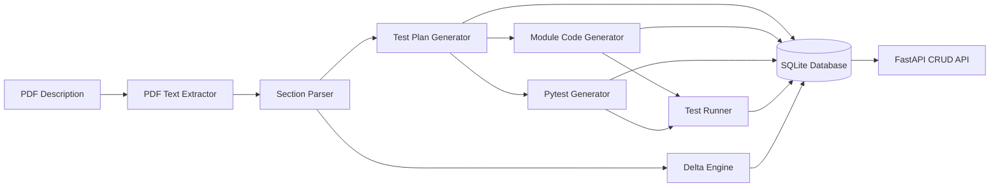

# Take-Home Architecture Plan

## Target Shape

Create a small importable Python package under [`/Users/anpandoh/software_gen_testing_automation`](file:///Users/anpandoh/software_gen_testing_automation) with both a CLI entry point for batch assignment runs and a FastAPI app exposing CRUD/read APIs over persisted artifacts:

The provided sample input [`/Users/anpandoh/Downloads/Problem_Description_Software_Coding.pdf`](file:///Users/anpandoh/Downloads/Problem_Description_Software_Coding.pdf) describes a `schedule_tasks(tasks, dependencies)` module. Use it as the local smoke-test fixture, but keep the pipeline generic because submission will be tested with different module-description PDFs.

## Core Design

- Use Python modules in [`src/swgen_test_automation`](file:///Users/anpandoh/software_gen_testing_automation/src/swgen_test_automation):
  - `config.py`: load YAML/TOML/env-backed settings for provider, model, API key reference, temperature, DB path, and generation toggles.
  - `pdf_reader.py`: extract text from arbitrary PDFs using `pypdf` and normalize page/section text.
  - `section_parser.py`: identify numbered sections/headings and produce stable section IDs for traceability.
  - `llm_client.py`: provider abstraction for OpenAI/Anthropic, selected from config, with no hardcoded keys.
  - `schemas.py`: Pydantic models for sections, test-plan items, generated code artifacts, generated tests, deltas, and execution results.
  - `generators.py`: prompt LLM for Pydantic-validated structured outputs, implementation module code, and pytest code.
  - `delta.py`: compare current and prior test-plan items by stable IDs/content hashes and store added/removed/modified items.
  - `database.py`: initialize SQLite schema and provide repository methods for descriptions, plans, items, deltas, generated code, tests, and results.
  - `api.py`: FastAPI application with OpenAPI-documented CRUD/read endpoints backed by the SQLite repositories.
  - `runner.py`: execute generated tests with pytest in a controlled output directory and capture pass/fail/failure messages.
  - `cli.py`: expose commands like `init-db`, `generate`, `run-tests`, `show-deltas`, and `serve`.

## Data Model

SQLite tables will mirror the assignment deliverables:

- `description_versions`: PDF path, extracted text hash, version, timestamp.
- `test_plans` and `test_plan_items`: plan version, item IDs, descriptions, source section IDs, expected behavior, category.
- `test_plan_deltas`: old/new version, change type, affected item IDs, before/after text.
- `generated_code`: module name, version, output path, code hash, timestamp.
- `generated_tests`: test name, test-plan item ID, output path, code hash, timestamp.
- `execution_results`: test name, test-plan item ID, status, failure message, duration, timestamp.
- `prompts`: prompt type, version, rendered prompt text, model/provider used.

## FastAPI And OpenAPI

Expose a small standards-based API over the SQLite database using FastAPI response/request models from `schemas.py`. FastAPI will generate the OpenAPI spec automatically at `/openapi.json` and interactive docs at `/docs`.

- `GET /health`: confirms service and database connectivity.
- `POST /description-versions` and `GET /description-versions/{version}`: create/read description metadata and extracted text hashes.
- `GET /test-plans/{version}` and `GET /test-plan-items/{version}`: retrieve generated plans and traceable items.
- `GET /deltas/{new_version}`: retrieve added/removed/modified test-plan deltas.
- `GET /generated-code/{version}` and `GET /generated-tests/{version}`: retrieve artifact metadata and file paths.
- `GET /execution-results/{version}`: retrieve pass/fail results mapped back to test-plan IDs.
- `POST /runs/generate` and `POST /runs/test`: optional convenience endpoints that invoke the same orchestration used by the CLI.

Keep all persistence writes in repository functions rather than endpoint bodies, so the CLI and API share the same behavior.

## Pydantic And LLM Contract

Use Pydantic models as the contract between the LLM, persistence layer, and artifact writers. The LLM should be called through provider-specific structured-output support when available, with a JSON-parse-plus-`model_validate` fallback for providers that only return text.

- `TestPlan`: contains `items[]` with `id`, `description`, `source_sections`, `test_type`, `expected_behavior`, and `edge_case`.
- `GeneratedModule`: contains `module_name`, `public_api`, `code`, `source_sections`, and related test-plan IDs.
- `GeneratedTestSuite`: contains test files/functions where each test maps to one or more test-plan IDs.
- `TestPlanDelta`: contains `added`, `removed`, and `modified` items with before/after descriptions.

For code-bearing outputs, keep the generated Python source as string fields inside validated Pydantic responses. This gives a standardized parseable envelope while still allowing the generated module and pytest files to be written exactly as source files.

Generated artifacts will be written to [`generated/`](file:///Users/anpandoh/software_gen_testing_automation/generated), so the interview discussion can inspect code, tests, plans, deltas, and result files easily.

## Implementation Flow

1. `generate --pdf path/to/problem.pdf --version v1` extracts text, sections it, stores the description version, prompts for a test plan, generates module code, generates pytest tests, and persists all artifacts.
2. `run-tests --version v1` runs pytest against generated tests and stores execution results.
3. `generate --pdf path/to/updated.pdf --version v2 --compare-to v1` repeats generation and stores test-plan deltas.
4. `serve` starts the FastAPI app so reviewers can inspect artifacts through standard OpenAPI docs.
5. `export-report --version v2` writes human-readable files for generated plan, deltas, prompts used, code paths, tests, and test results.

For the sample scheduler PDF, the expected generated plan should include traceable items for:

- API shape: `schedule_tasks(tasks: list[str], dependencies: list[tuple[str, str]]) -> list[str]` from section `1.1`.
- Ordering invariants: every task appears once, dependencies precede dependents, and available tasks use lexicographic order from section `1.2`.
- Error handling: duplicate tasks, unknown dependency references, cycles, invalid task/dependency input types from section `1.3`.
- Boundary cases: empty input, single task, no dependencies, long chain, independent chains, and diamond graph from section `1.4`.
- Assumptions: case-sensitive task names and expected topological-sort complexity from section `1.5`.

## Testing Strategy

- Unit-test deterministic parts: config loading, PDF text normalization with fixtures, section parsing, SQLite initialization, FastAPI endpoint behavior, delta comparison, and pytest result parsing.
- Mock `llm_client.py` in tests so package tests do not require real API keys.
- Include one integration-style test using a fake LLM response to verify the full pipeline writes expected database rows and generated files.
- Include the scheduler PDF as the manual end-to-end smoke test for generated plan/code/tests/results before packaging the submission.

## Interview-Friendly Decisions

- Keep LLM generation required for actual assignment output, but isolate it behind `llm_client.py` so provider/model/key changes are configuration-only.
- Store prompts and model metadata because the assignment explicitly asks for prompts and LLMs/agents used.
- Prefer Pydantic structured outputs between LLM and system to make parsing, validation, traceability, and delta detection explainable.
- Use SQLite because it satisfies the persistence requirement without infrastructure overhead.
- Use FastAPI/OpenAPI for standard CRUD inspection of stored artifacts, while keeping the CLI for the assignment's generation and test-execution workflow.